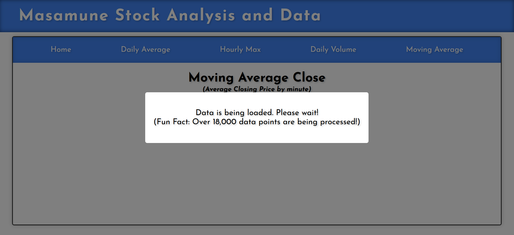
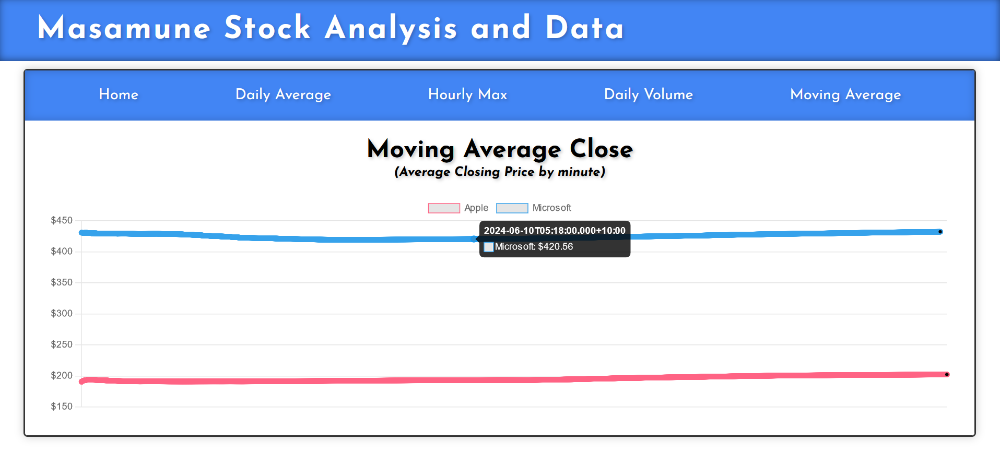

# Apple Vs Microsoft
(https://tim-broderick.com/applevsmicrosoft)

This comprehensive full-stack Python web application begins by fetching the latest minute-by-minute stock data for Microsoft and Apple from the Alpha Vantage API. The fetched data is then securely stored in an AWS S3 bucket. Utilizing Apache Spark for local processing, the application retrieves the stock data from the S3 bucket, performs necessary data transformations and analyses, and subsequently saves the processed data back to the S3 bucket.

On the backend, the application is powered by a Flask web server, which is hosted on an AWS EC2 instance. This server facilitates JWT authentication, with user credentials securely managed in AWS DynamoDB.

The frontend is built with React and TypeScript, ensuring a responsive and dynamic user experience. For data visualization, the application employs Chart.js, providing clear and interactive stock data charts. The application’s security is reinforced through JWT authentication, integrating seamlessly with the backend to ensure secure access to user-specific data.

## Technologies Used

- Backend: Python, Flask, JWT Authentication
- Data Processing: Apache Spark, Pandas
- Data Storage: AWS S3, AWS DynamoDB
- API Integration: Alpha Vantage API
- Frontend: React, TypeScript, Chart.js
- Hosting: AWS EC2

## Table of Contents
- [Apple Vs Microsoft](#apple-vs-microsoft)
  - [Technologies Used](#technologies-used)
  - [Table of Contents](#table-of-contents)
  - [Screenshots](#screenshots)
  - [Highlights](#highlights)
  - [How to Get Started?](#how-to-get-started)
  - [Note](#note)
  - [Lessons Learned](#lessons-learned)
  - [Difficulties](#difficulties)
  - [Future Implementations](#future-implementations)

## Screenshots





## Highlights

- **Data Fetching**: Utilizes the Alpha Vantage API to fetch minute-by-minute stock data for Microsoft and Apple.
- **Data Processing**: Efficiently processes stock data using Apache Spark (currently utilizing two cores).
- **Data Storage**: Securely stores and retrieves data from an AWS S3 bucket.
- **Data Visualization**: Visualizes stock data with interactive and informative charts using Chart.js.
- **Backend Hosting**: The Flask backend is hosted on an AWS EC2 instance, ensuring reliable and scalable performance.
- **Authentication**: Implements secure JWT authentication with user credentials managed in AWS DynamoDB.
- **Frontend Development**: Built with React and TypeScript for a dynamic and responsive user interface.

## How to Get Started?

Follow these steps to set up and run the project:

<details>
  <summary>Prerequisites</summary>

  Before you begin, ensure you have the following:

  1. **AWS Account**: Create an AWS account at [AWS](https://aws.amazon.com/console/).
  2. **Alpha Vantage API Key**: Sign up and get your API key from [Alpha Vantage](https://www.alphavantage.co/support/#api-key).
</details>

<details>
  <summary>Setting Up AWS IAM User for Development</summary>

  1. **Create an IAM User**:
     - Go to the [IAM Dashboard](https://console.aws.amazon.com/iam/).
     - Click on "Users" and then "Add user".
     - Name your user (e.g., "spark_user").
     - Select "Programmatic access" for the access type.
     - Click "Next: Permissions".

  2. **Attach Policies**:
     - Click "Attach existing policies directly".
     - Select "AmazonS3FullAccess" and "AmazonDynamoDBFullAccess".
     - Click "Next: Tags", then "Next: Review", and finally "Create user".

  3. **Save Access Keys**:
     - Save the Access Key ID and Secret Access Key. You'll need them for configuring AWS CLI and your `.env` file.

  4. **Set Up AWS Credentials**:
     - On **both** your local machine and EC2 instance, configure AWS CLI with your new user's credentials:
       ```bash
       aws configure
       ```
     - Provide your AWS Access Key, Secret Key, and the region (e.g., `ap-southeast-2`).
</details>

<details>
  <summary>Setting Up the EC2 Instance</summary>

  1. **Launch an EC2 Instance**:
     - Go to the [EC2 Dashboard](https://console.aws.amazon.com/ec2/).
     - Click on "Launch Instance".
     - Name your instance (e.g., "simple-stock-analysis").
     - For the OS Image, choose "Amazon Linux 2023".
     - Leave architecture as "64-bit (x86)" and instance type as "t2.micro".
     - Create a new key pair, name it (e.g., "simple-stock-analysis"), select "RSA" and ".pem" for the file type, and download it.
     - Under Network Settings, allow SSH traffic from "My IP". (If you change networks, you will have to update this)
     - Leave storage as the default 8 GiB.
     - Click "Launch Instance".
     - Take note of the Public IPv4 DNS (e.g., ec2-X-XXX-XXX-XX.ap-southeast-2.compute.amazonaws.com).

  2. **Connect to Your EC2 Instance**:
     - Open Git Bash and connect to your EC2 instance using the command:
       ```bash
       ssh -i /path/to/your/simple-stock-analysis.pem ec2-user@ec2-X-XXX-XXX-XX.ap-southeast-2.compute.amazonaws.com
       ```
</details>

<details>
  <summary>Setting Up an IAM Role for EC2</summary>

  1. **Create an IAM Role**:
     - Go to the [IAM Dashboard](https://console.aws.amazon.com/iam/).
     - Click on "Roles" and then "Create role".
     - Select "AWS service" and then "EC2".
     - Click "Next: Permissions".

  2. **Attach Policies**:
     - Select "AmazonS3FullAccess" and "AmazonDynamoDBFullAccess".
     - Click "Next: Tags", then "Next: Review".
     - Name your role (e.g., "EC2_S3_DynamoDB_Access").
     - Click "Create role".

  3. **Assign Role to EC2 Instance**:
     - Go to the [EC2 Dashboard](https://console.aws.amazon.com/ec2/).
     - Select your instance, click on "Actions" -> "Security" -> "Modify IAM Role".
     - Select the newly created role (e.g., "EC2_S3_DynamoDB_Access") and click "Update IAM role".
</details>

<details>
  <summary>Copying Files & Setting Up the Python Virtual Environment</summary>

  1. **Transfer Files**:
     - Use a tool like [WinSCP](https://winscp.net/eng/docs/guide_amazon_ec2) or the console to transfer `app.py`, `fetch_stock_data.py`, `process_data.py`, `setup_db.py`, `templates` folder, and `build` folder to your EC2 instance.

  2. **Set Up Python Virtual Environment**:
     - On your EC2 instance, run the following commands:
       ```bash
       sudo yum update -y
       sudo yum install python3 -y
       python3 -m venv venv
       source venv/bin/activate
       pip install flask boto3 pandas requests python-dotenv passlib flask-cors flask-jwt-extended
       ```
  3. **Create a .env file for keys**:
     - In the root directory, create a `.env` file:
       ```plaintext
       ALPHA_VANTAGE_API_KEY=XXXXXXX
       AWS_ACCESS_KEY_ID=XXXXXXXXXX
       AWS_SECRET_ACCESS_KEY=XXXXXXXXXX
       ```
      - Update with the values from when you previously created your user ('Setting Up AWS IAM User for Development')
</details>

<details>
  <summary>Setting Up AWS S3</summary>

  1. **Create an S3 Bucket**:
     - Go to the [S3 Dashboard](https://console.aws.amazon.com/s3/).
     - Click on "Create bucket".
     - Name your bucket "simple-stock-analysis" (if you use another name, you will need to update the code).
     - Choose a region close to you.
     - Leave other settings as default and create the bucket.
</details>

<details>
  <summary>Setting Up AWS DynamoDB</summary>

  1. **Create a DynamoDB Table**:
     - Go to the [DynamoDB Dashboard](https://console.aws.amazon.com/dynamodb/).
     - Click on "Create table".
     - Name your table "users".
     - Set the Primary key to "username" (Type: String).
     - Leave other settings as default and create the table.

  2. **Run the `setup_db.py` Script**:
     - Ensure the `setup_db.py` file is transferred to your EC2 instance.
     - The script will create the table if it doesn't exist and insert user data.
     - On your EC2 instance, run the following commands:
       ```bash
       python setup_db.py
       ```

</details>

<details>
  <summary>Running the Fetch Data Script</summary>

  1. **Configure AWS Credentials**:
     - On your EC2 instance, configure AWS CLI with your credentials:
       ```bash
       aws configure
       ```
     - Provide your AWS Access Key, Secret Key, and the region where your S3 bucket is located (e.g., `ap-southeast-2`).

  2. **Run the Fetch Data Script**:
     - Run the following command to fetch data from the Alpha Vantage API and upload it to your S3 bucket:
       ```bash
       python fetch_stock_data.py
       ```
</details>

<details>
  <summary>Running the Process Data Script Locally</summary>

  1. **Set Up Local Environment**:
     - On your local machine, set up a Python virtual environment and install the necessary dependencies:
       ```bash
       python -m venv venv
       source venv/bin/activate
       pip install pyspark boto3 pandas python-dotenv
       ```

  2. **Configure AWS Credentials Locally**:
     - Configure AWS CLI with your credentials:
       ```bash
       aws configure
       ```

  3. **Power up! (Optional)**:
     - Within `process_data.py`, look for:
        ```python
        executor_memory = "4g" 
        driver_memory = "4g" 
        executor_cores = "3"
        cores_max = "3"
        ```  
      - If your available system resources exceed the above (or are below the above), feel free to update the above values. (Higher values will positively influence the performance)

  4. **Run the Process Data Script**:
     - Run the following command to process the data locally and upload the results back to the S3 bucket:
       ```bash
       python process_data.py
       ```
</details>

<details>
  <summary>Running the Flask Application</summary>

  1. **Run the Flask App on EC2**:
     - On your EC2 instance, start the Flask application:
       ```bash
       source venv/bin/activate
       python app.py
       ```

  2. **Access the Application**:
     - Open your browser and navigate to `http://<your-ec2-public-dns>:5000` to access the application.
</details>

<details>
  <summary>Setting Up the React Frontend</summary>

  1. **Transfer React Build Files**:
     - Ensure your React app is built using `npm run build`.
     - Transfer the contents of the `build` folder to the EC2 instance.

  2. **Serve the React App with Flask**:
     - Ensure `app.py` is set up to serve the React app as shown in the previous steps.
     - Access the application using the public DNS of your EC2 instance.
</details>

<details>
  <summary>Installing and Running Gunicorn (Optional)</summary>

  1. **Install Gunicorn**:
     - On your EC2 instance, install Gunicorn:
       ```bash
       pip install gunicorn
       ```

  2. **Run the Flask App with Gunicorn**:
     - Run the following command to start the Flask application with Gunicorn:
       ```bash
       gunicorn --bind 0.0.0.0:5000 app:app
       ```
</details>

## Note

To keep the app running even when the terminal is closed, consider using [tmux](https://github.com/tmux/tmux/wiki).

## Lessons Learned

- Utilizing an EC2 instance and implementing security rules, roles and other settings through the AWS management console. 
- Integrating and utilizing APIs for real-time data retrieval.
- Utilizing Spark to process large datasets efficiently (unfortunately not able to use it to its full potential but able to process data using multiple cores).
- Storing data in an AWS S3 bucket and accessing it programatically.
- Implementing JWT through Flask and storing credentials securely in DynamoDB
- The logistics involved with processing and data around. e.g. Accessing S3, renaming / moving files, ensuring that data is accessible
- Implementing data visualization techniques to present data effectively.
- Building a Flask application and serving dynamic content.
- Running that Flask backend off an EC2 instance 
- An overall better understanding of Python and its ecosystem.

## Difficulties

- Resource manamgement: There were often situations where the memory required by Spark was greater than the memory provided by the EC2 instance (1gb) so resorted to doing it locally.
- Debugging issues related to data inconsistencies: Having so many steps involved with the processing of the data allowed for more errors.
- Ensuring smooth integration between different components of the application: I had a lot of trouble (at first) setting up the EC2 instance and making sure that the data being processed could be transferred to and from the S3 bucket. 
- AWS & Spark interactions: Required very specific versions of the jar files required. 
- The implementation of JWT authentication through Flask was suprisingly easy; however, I had issues with the JWT token persisting and not having an expiry. 
- Couldn't set up the SSH tunnel extention on VSCode so through the terminal accessed the EC2 instance and coded in Nano.

## Future Implementations

- Adding more stock symbols for comparison.
- Implementing more sophisticated data analysis techniques.
- Implementing JWT authetication with user roles. 
- Enhancing the user interface for better user experience.
- Implementing real-time data updates for the charts.
- Making greater use of AWS services. 

Thank you
