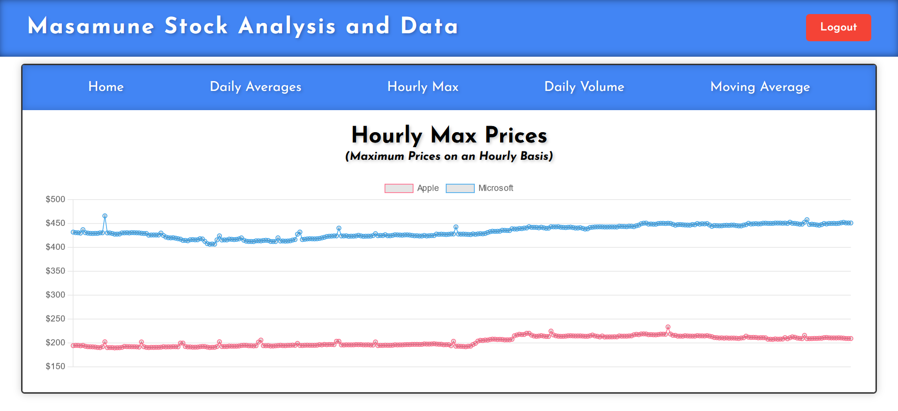

# Apple Vs Microsoft 
(https://tim-broderick.com/applevsmicrosoft)

This full-stack Python web application fetches minute-by-minute stock data on Microsoft and Apple from the Alpha Vantage API and stores the received data in an AWS S3 bucket. It retrieves the data from the bucket, processes the data (locally) using Spark, and then returns the resulting processed data to the S3 bucket. The data is finally visualized using Chart.js on a Flask web server hosted on an AWS EC2 instance. 

The visualizations available to the user include:
- Daily average closing prices
- Hourly maximum prices
- Daily trading volumes
- Moving average of closing prices

## Table of Contents
- [Apple Vs Microsoft](#apple-vs-microsoft)
  - [Table of Contents](#table-of-contents)
  - [Screenshots](#screenshots)
  - [Highlights](#highlights)
  - [How to Get Started?](#how-to-get-started)
  - [Lessons Learned](#lessons-learned)
  - [Difficulties](#difficulties)
  - [Future Implementations](#future-implementations)

## Screenshots

## Highlights

- Utilizes the Alpha Vantage API to fetch detailed stock data.
- Processes data using Spark (currently only utilising two cores)
- Stores and retrieves data from an AWS S3 bucket.
- Visualizes data using Chart.js for interactive and informative charts.
- Flask backend is served on an AWS EC2 instance. 

## How to Get Started? 

  1. Create an AWS account (https://aws.amazon.com/console/)
  2. Setup a (free) EC2 instance:
     1. Create a name for your instance
     2. For the OS Image, leave as Amazon Linux (if you do select something else, be aware there could be costs involved)
     3. Leave the architecture and the instance type as 64-bit (x86) and t2.micro
     4. Create a Key Pair (a file that will allow you access AWS services, etc.):
        1. Name: simple-stock-analysis (anything is fine though)
        2. Select RSA and .pem for the filetype
     5. Network Settings:
        1. Leave all settings as they are.
        2. Allow SSH traffic from --> "My IP" (allows only your IP access)
     6. Storage:
        1. Feel free to add more than 8GiB but 8Gib will be more than enough. 
     7. Advanced Settings can be skipped
     8. Review the Summary and "Launch Instance"
  3. Using Git Bash 

## Lessons Learned

- Utilizing an EC2 instance and implementing security rules, roles and other settings through the AWS management console. 
- Integrating and utilizing APIs for real-time data retrieval.
- Utilizing Spark to process large datasets efficiently (unfortunately not able to use it to its full potential but able to process data using multiple cores).
- Storing data in an AWS S3 bucket and accessing it programatically.
- The logistics involved with processing and data around. e.g. Accessing S3, renaming / moving files, ensuring that data is accessible
- Implementing data visualization techniques to present data effectively.
- Building a Flask application and serving dynamic content.
- Running that Flask backend off an EC2 instance 
- An overall better understanding of Python and its ecosystem.

## Difficulties

- Resource manamgement: There were often situations where the memory required by Spark was greater than the memory provided by the EC2 instance (1gb) so had to do that locally.
- Debugging issues related to data inconsistencies: Having so many steps involved with the processing of the data allowed for more errors.
- Ensuring smooth integration between different components of the application: I had a lot of trouble (at first) setting up the EC2 instance and making sure that the data being processed could be transferred to and from the S3 bucket. 
- AWS & Spark interactions: Required very specific versions of the jar files required.  
- Couldn't set up the SSH tunnel extention on VSCode so through the terminal accessed the EC2 instance and coded in Nano.

## Future Implementations

- Adding more stock symbols for comparison.
- Implementing more sophisticated data analysis techniques.
- Implementing JWT autheticaiton with user roles, etc. 
- Enhancing the user interface for better user experience.
- Implementing real-time data updates for the charts.
- Making greater use of AWS services 